# CMS BCDA FHIR Pipeline

An end-to-end bulk FHIR ingestion and analytics pipeline built on the [CMS Beneficiary Claims Data API (BCDA)](https://bcda.cms.gov/) sandbox — 10,000 synthetic Medicare enrollees, no approval required.

**Stack:** Python · GCS · BigQuery · dbt-bigquery · Apache Airflow (Astro CLI) · GitHub Actions · Evidence.dev

## Architecture

```
CMS BCDA API (sandbox)
      │  async bulk export (NDJSON)
      ▼
GCS Bronze  ─── raw NDJSON by resource type + transaction_time
      │  flatten + Parquet conversion (Python)
      ▼
GCS Silver  ─── Parquet by resource type
      │  BigQuery load job (WRITE_TRUNCATE)
      ▼
BigQuery Silver (silver_patient, silver_coverage, silver_eob)
      │  dbt staging → intermediate → marts
      ▼
BigQuery Gold (dim_patient, fct_claims, fct_coverage)
      │  Evidence.dev
      ▼
Dashboard (population overview, claims analysis, coverage)
```

**Orchestration:** Apache Airflow (Astro CLI) — weekly schedule, TaskFlow API, Slack alerting
**CI/CD:** GitHub Actions — dbt compile + test on every PR

## What This Demonstrates

- Bulk FHIR R4 async job pattern (kick off → poll → download) with token refresh during long-running polls
- NDJSON streaming to GCS without loading into memory
- FHIR resource flattening (Patient, Coverage, ExplanationOfBenefit) grounded in actual data exploration, not just API docs
- Watermark-based incremental loads using BCDA's `_since` parameter
- Idempotent pipeline design — safe to re-run at any layer, including handling of edge cases where idempotency assumptions break down (see Data Quality Findings)
- Memory-safe processing of a 996K-row fact table via per-blob chunked transformation
- dbt staging → intermediate (array unnesting) → mart layer
- dbt-expectations data quality tests, including deliberate `warn`-vs-`fail` severity decisions
- Airflow TaskGroup, XCom, per-task retry policy, Slack success/failure alerting with run duration
- GitHub Actions CI against BigQuery — used to catch a real multi-layer data bug during development
- Evidence.dev dashboard with data quality findings surfaced directly in the UI, not hidden

## Prerequisites

- Python 3.10+
- GCP account (free tier + $300 trial credit covers this project)
- [Astro CLI](https://docs.astronomer.io/astro/cli/install-cli) for Airflow
- Node.js 18+ for Evidence.dev
- [direnv](https://direnv.net/) (recommended) for automatic environment variable loading

## Setup

```bash
# 1. Clone and enter the repo
git clone https://github.com/anZro/cms-fhir-pipeline.git
cd cms-fhir-pipeline

# 2. Create your .env from the example
cp .env.example .env
# Fill in GCP_PROJECT_ID, GCS_BUCKET, and point GOOGLE_APPLICATION_CREDENTIALS
# at your downloaded service-account.json

# 3. Install Python dependencies
pip install -r requirements.txt

# 4. Install dbt dependencies
cd dbt_fhir && dbt deps && cd ..
```

### Local Development

This project uses [direnv](https://direnv.net/) to automatically load environment variables when you `cd` into the project directory — no manual `export` or `source` steps required. Install direnv and run `direnv allow` in the project root.

Two environment files are used:
- `.env` — container path for `GOOGLE_APPLICATION_CREDENTIALS`, used by Airflow/Docker
- `.env.local` — local filesystem path, used when running Python scripts directly from the terminal

## Makefile Targets

| Command | What it does |
|---|---|
| `make ingest` | Auth → kick off BCDA export → poll → download NDJSON to GCS Bronze |
| `make transform` | Flatten NDJSON → Parquet → write to GCS Silver |
| `make load` | Load Silver Parquet from GCS into BigQuery |
| `make dbt-run` | Run all dbt models (staging → intermediate → marts) |
| `make dbt-test` | Run all dbt tests |
| `make all` | End to end |

## Airflow (Astro CLI)

```bash
astro dev start
# Open http://localhost:8080
# DAG: bcda_pipeline — scheduled @weekly
```

The DAG orchestrates the full pipeline: token fetch → watermark read → BCDA export kick-off → polling (with token refresh for long-running jobs) → parallel downloads (Patient, Coverage, EOB) → transform → BigQuery load → dbt run → watermark write. Slack alerts fire on both success (with run duration) and failure (with a direct log link).

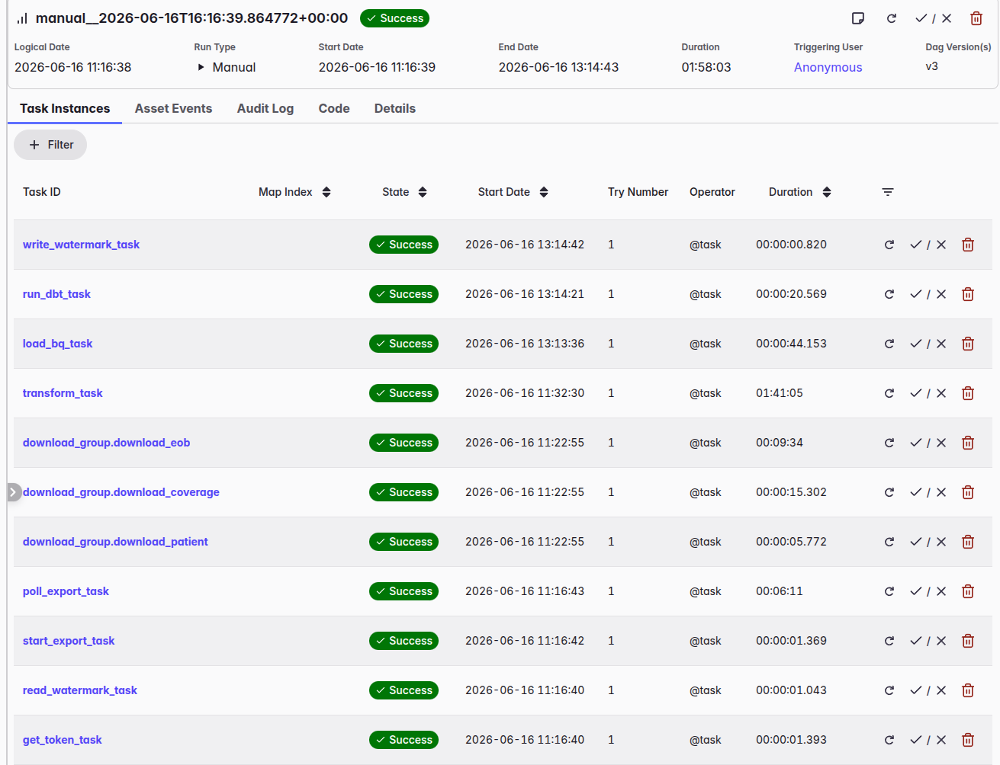
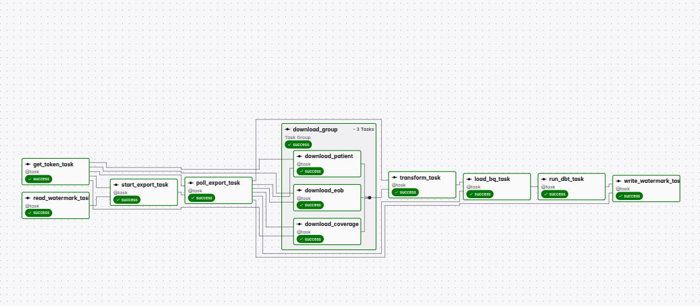
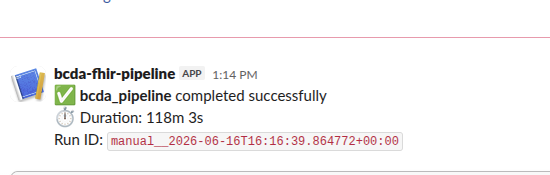
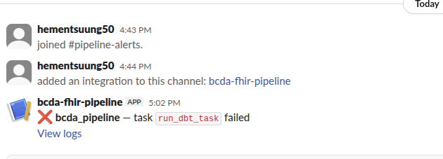

## Evidence.dev Dashboard

```bash
cd evidence-app
npm install
npm run sources
npm run dev
# Open http://localhost:3000
```

Three pages, each querying BigQuery Gold tables directly — never staging or intermediate models, which are internal implementation details:

- **Population Overview** — beneficiary count, gender and race/ethnicity distribution
- **Claims Analysis** — total claims/payments, claims by type, top 20 diagnosis codes, monthly trend, PDE payment-field finding
- **Coverage & Eligibility** — Medicare part distribution, dual eligibility status, service-activity-as-enrollment-proxy finding

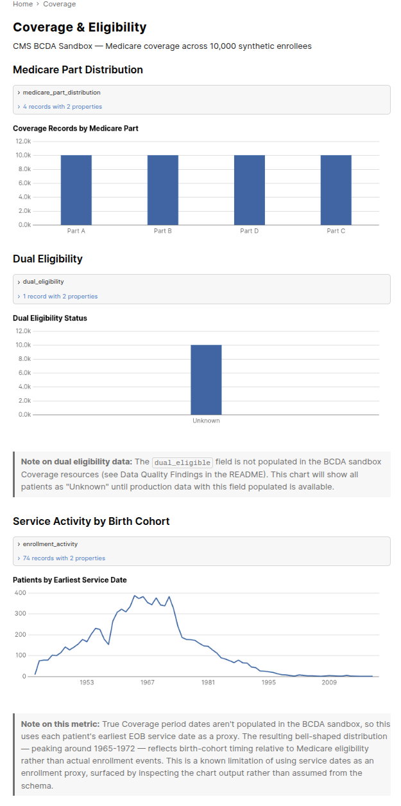
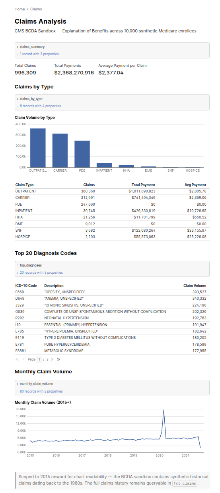

## Project Structure

```
cms-fhir-pipeline/
├── ingest/          # Auth, export, polling, download, BQ load, watermark
├── transform/       # FHIR flatteners: Patient, Coverage, EOB → Parquet
├── dbt_fhir/        # dbt project: staging → intermediate → marts
├── dags/            # Airflow DAG
├── evidence-app/    # Evidence.dev dashboard
└── .github/         # GitHub Actions CI
```

## Key Design Decisions

**Why async bulk export?** BCDA returns data for potentially millions of beneficiaries — a synchronous request would time out. Kick-off → poll → download is standard for bulk FHIR.

**Why fixed-interval polling rather than exponential backoff?** This is a progress-check pattern, not a retry pattern. The job is healthy and running; a 30-second fixed interval means roughly 6-20 checks total, well within any rate limit, without artificially extending wait time the way backoff would.

**Why refresh the bearer token during polling?** BCDA tokens expire after 20 minutes. Export jobs can sit in a `Pending` queue state for longer than that before processing even begins. Token refresh is checked on every poll attempt but only hits the network when the cached token is within 60 seconds of expiry.

**Why NDJSON → Parquet before BigQuery, and why stream both?** Loading raw JSON into BigQuery is slower and more expensive than columnar Parquet. Streaming avoids holding multi-GB files in memory — `download.py` streams raw bytes to avoid buffering the transfer; `transform/eob.py` processes one Bronze file at a time and writes one Silver Parquet part per file, since holding all ~996K flattened records in memory simultaneously caused OOM kills in containerized execution.

**Why include `transaction_time` in GCS paths?** Idempotency — re-running the same export job always writes to the same path, so retries overwrite cleanly instead of duplicating. This assumption broke down in one specific case — see Data Quality Findings below.

**Why store `diagnosis_json` as a raw string in Silver rather than exploding it in Python?** A single EOB claim can carry 10-25 diagnosis codes. Exploding this in Python changes the grain from one-row-per-claim to one-row-per-diagnosis, forcing every downstream consumer to work at the wrong grain. Storing the raw array and exploding in dbt's `int_eob_diagnoses` model means Silver stays at claim grain, and only models that specifically need multi-diagnosis analysis pay the join cost.

**Why are staging models views and marts tables?** Staging views are just a typed window into Silver — always fresh after an ingest run, with no expensive computation worth caching. Marts are tables because they're the stable, expensive-to-compute, frequently-queried layer that BI tools depend on.

**Why does the dashboard query marts only, never staging or intermediate?** Marts are the stable contract layer. Staging and intermediate models are internal implementation details that can change as the pipeline is refactored; a dashboard built against them would break silently. Marts are the layer explicitly designed to be a dependable interface.

**Why `WRITE_TRUNCATE` for BigQuery loads?** Silver is already idempotent at the GCS layer — the same `transaction_time` always produces the same Parquet content. Truncating and reloading guarantees BigQuery always reflects exactly what's in Silver, with no risk of partial-run duplicates.

## Data Quality Findings

This section documents real issues discovered during development — surfaced by dbt tests, CI runs, and dashboard inspection — along with the investigation process and resolution. These are included deliberately: finding, diagnosing, and documenting data quality issues is treated as a first-class part of this project, not an afterthought.

### 1. Bronze/Silver File Accumulation on a Static Watermark

**Symptom:** dbt's `unique` tests on `eob_id`, `patient_id`, and `coverage_id` failed in CI — every single row in `stg_patient`, `stg_coverage`, and `stg_eob` was flagged as a duplicate (e.g., 996,309 of 996,309 rows for EOB).

**Investigation:** Querying BigQuery directly confirmed real duplicates — each `patient_id` appeared exactly 13 times. Tracing back to GCS Bronze showed 26 Patient NDJSON files under a single `transaction_time` prefix, when only 2 were expected.

**Root cause:** The pipeline's idempotency design assumed `transaction_time` (sourced from BCDA's `transactionTime` field) would change between runs. In practice, repeated manual testing and DAG re-triggers against the static, unchanging BCDA sandbox dataset returned the *same* `transaction_time` every time. Each download used a UUID from the BCDA response URL as the filename — unique per request, but with no relationship to prior runs — so 13 separate test runs silently accumulated 13x the expected files in the same GCS prefix instead of overwriting.

A second instance of the same root cause was found one layer downstream: `transform_eob`'s per-blob Parquet write pattern (`eob_part_0000.parquet`, `eob_part_0001.parquet`, ...) accumulated to 2,398 part files in Silver when only 200 were expected, for the identical reason.

**Fix:** Download tasks and `transform_eob` now clear all existing blobs under their respective GCS prefixes before writing fresh files, restoring the intended idempotency guarantee. `transform_patient` and `transform_coverage` did not need this fix — they write to a single deterministic file path, which GCS overwrites natively on every write. Only the EOB transform's multi-file wildcard pattern was vulnerable to accumulation.

**A related bug found during the same investigation:** `download_coverage` and `download_eob` were both filtering on `item["type"] == "Patient"` due to a copy-paste error, meaning they had been silently downloading zero files on every run. This had gone unnoticed because local testing (run via `python3 -m ingest.download`) used a different, already-fixed version of `download.py` — the bug only existed in the DAG's task-level reimplementation of the same filtering logic.

### 2. Coverage `period_start` / `period_end` Are Never Populated

**Symptom:** `dbt run` failed on `stg_coverage` with `Invalid cast from INT64 to DATE` — BigQuery's `autodetect` schema inference assigned `INT64` to columns that were entirely null in every record.

**Investigation:** Inspecting raw Coverage FHIR resources directly confirmed `period.start` and `period.end` are absent from every Coverage record in the BCDA sandbox — this is a sandbox data characteristic, not a transform bug.

**Resolution:** Explicit string casting was added in `transform/coverage.py` for `period_start`, `period_end`, and `dual_eligible` before writing Parquet, preventing pyarrow from inferring a numeric type for all-null columns. Rather than attempt to backfill these from another field, enrollment activity is instead derived from EOB service dates in `fct_coverage` (see Finding 4) — a deliberate choice to surface a usable signal from data that does exist, rather than leave a gap.

### 3. PDE (Part D) Claims Show $0.00 Total Payment

**Symptom:** The Claims Analysis dashboard showed `$0.00` total payment for PDE and SNF claim types.

**Investigation:** Querying `fct_claims` confirmed `total_payment = 0` consistently for PDE records, while `total_amount` (a different field) showed real, non-zero values. Inspecting a raw PDE FHIR resource revealed the cause: `payment.amount` doesn't exist at all on Part D drug event resources — only a `payment.date` is present. The actual drug cost instead lives in the `total[]` array under category code `drugcost`.

**Resolution:** Documented rather than fixed, to avoid a full pipeline re-run late in the build. A production fix would have `flatten_eob` conditionally extract payment based on claim type, falling back to the `drugcost` entry in `total[]` when `payment.amount` is absent. The finding itself — tracing a `$0` anomaly on the dashboard back to a genuine structural difference in the CARIN BB FHIR profile between institutional and pharmacy claims — is preserved as a callout directly on the dashboard page rather than silently corrected.

### 4. "Enrollment Activity" Reflects Birth Cohort, Not Enrollment

**Symptom:** A chart intended to show enrollment activity over time (using EOB service dates as a proxy for the missing Coverage period dates — see Finding 2) produced a smooth bell curve peaking around 1965-1972, rather than the expected pattern.

**Investigation:** Querying the year distribution directly showed a clean bell shape, not noise or a long outlier tail. This is consistent with patients' earliest service dates correlating with their Medicare-eligibility age relative to birth year — Medicare itself began in 1965, and a synthetic population's "first service" dates clustering there reflects birth-cohort timing, not actual enrollment events.

**Resolution:** The chart and its underlying metric were relabeled "Service Activity by Birth Cohort" with an explanatory callout, rather than presented as enrollment data it doesn't actually represent. This is a known limitation of using service dates as an enrollment proxy when true Coverage period dates aren't available.

### 5. March 2020 Claim Volume Spike

**Symptom:** The monthly claim volume trend chart shows a sharp, single-month spike — Outpatient claims jump from a ~2,000/month baseline to 8,636; Inpatient claims jump 7x; the spike appears simultaneously across all claim categories.

**Investigation:** Breaking the spike down by claim type and month confirmed it is concentrated entirely in March 2020 and resolves back to baseline by April — consistent with the documented onset of COVID-19 healthcare utilization patterns in the United States. This suggests BCDA's synthetic data generation incorporates realistic population-level utilization shifts tied to real-world events, rather than purely random generation.

**Resolution:** Preserved in the dashboard with an explanatory callout rather than treated as an anomaly to filter out — it's a genuinely interesting signal in the synthetic data.

## Production Enhancements (Not Implemented Here)

These are noted as deliberate scope decisions for a portfolio project, not oversights:

- **Great Expectations** at the transform layer to validate Silver DataFrames before writing to GCS, catching schema drift and null violations before they reach BigQuery.
- **Astronomer Cosmos** to surface individual dbt models as visible Airflow tasks rather than one opaque `subprocess` call, improving per-model observability and retry granularity.
- **Airflow Connections/Variables** rather than passing the BCDA bearer token through XCom, which persists in the metadata database in plaintext.
- **PDE payment extraction fix** (Finding 3) and **dual eligibility / period date backfill** (Finding 2) if BCDA's production API populates these fields more completely than the sandbox.
- **Parallelized EOB downloads** — currently sequential within a single task; splitting across multiple tasks would reduce the dominant runtime cost in the pipeline (EOB download + transform consistently the longest stage).

## Screenshots

| | |
|---|---|
| 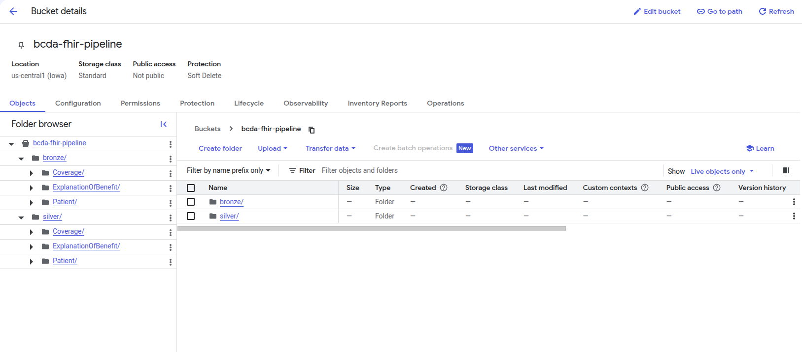 | 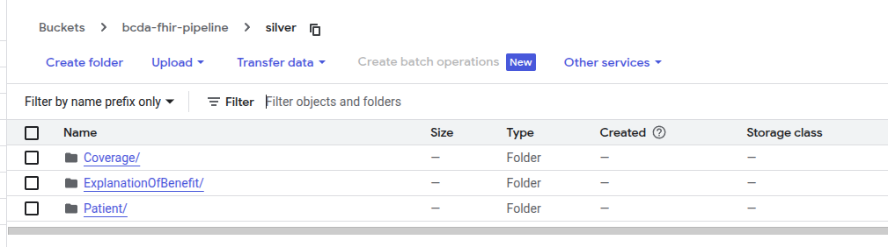 |
| 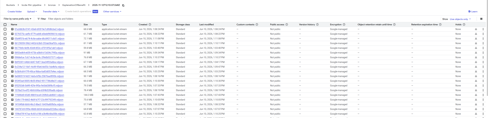 | 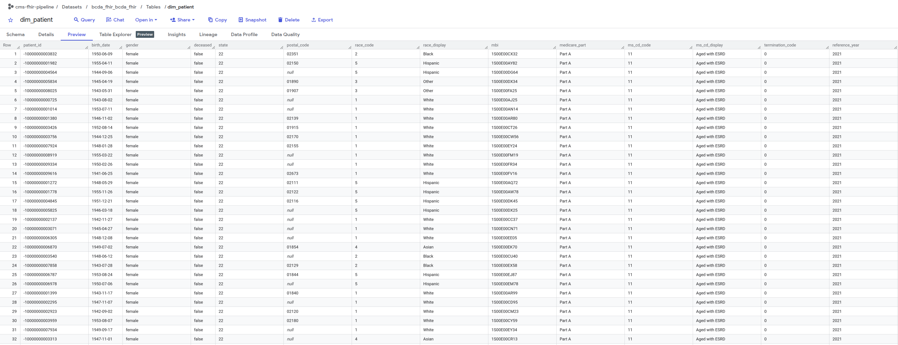 |
| 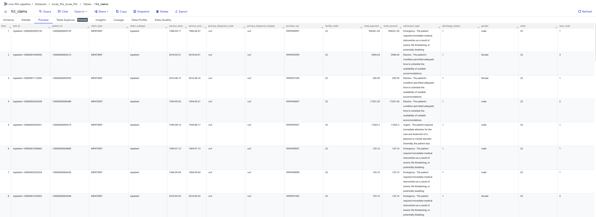 | 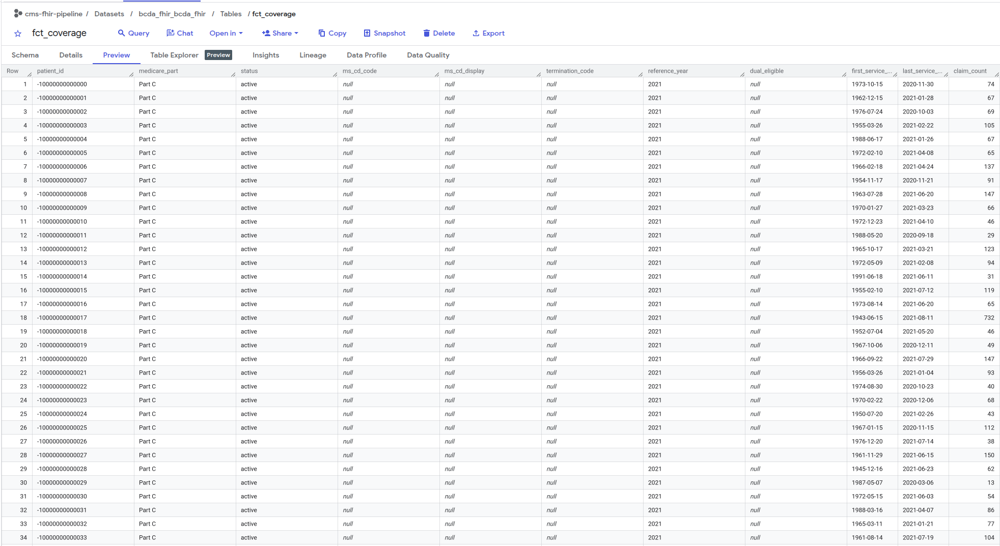 |
| 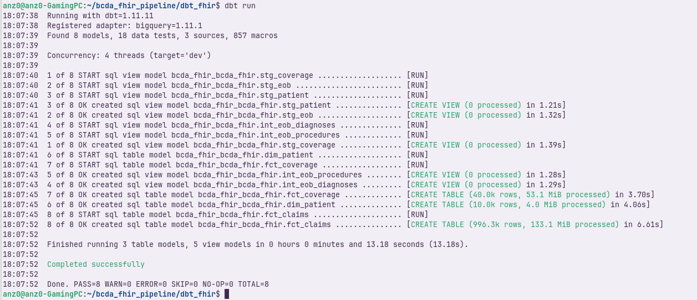 | 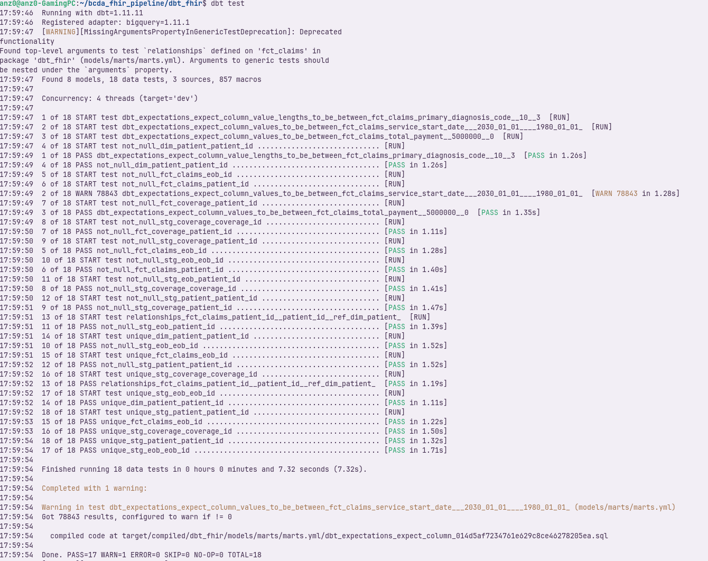 |
| 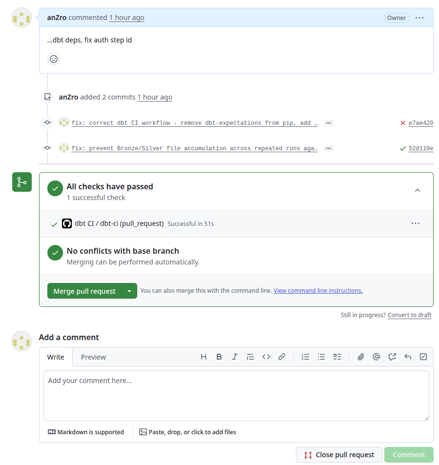 | |
